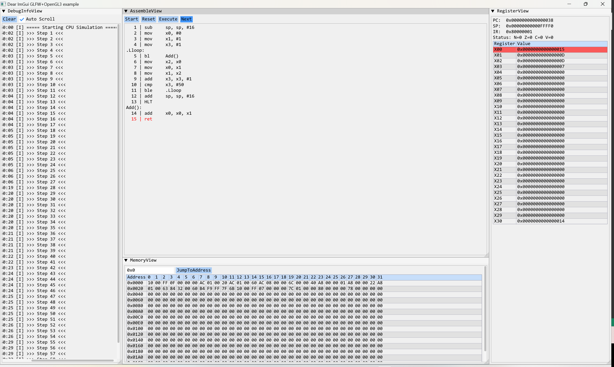
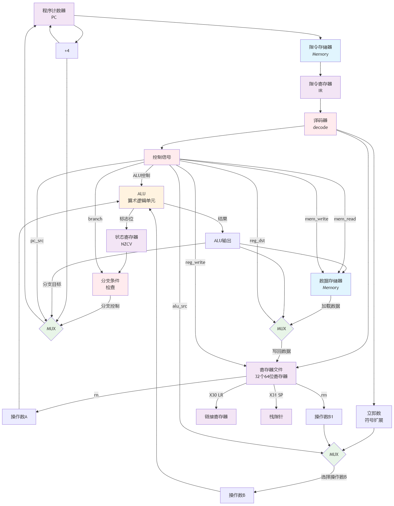

# TinyAArch64

> 指令格式设计

| 32-31  | 30-26     | 25-21   | 20-16   | 15-0            |
|--------|-----------|---------|---------|-----------------|
| sf(1b) | opcode(5) | rd (5b) | rn (5b) | rm(5b)/imm(16b) |

---

> GUI界面

---

> 数据通路图

